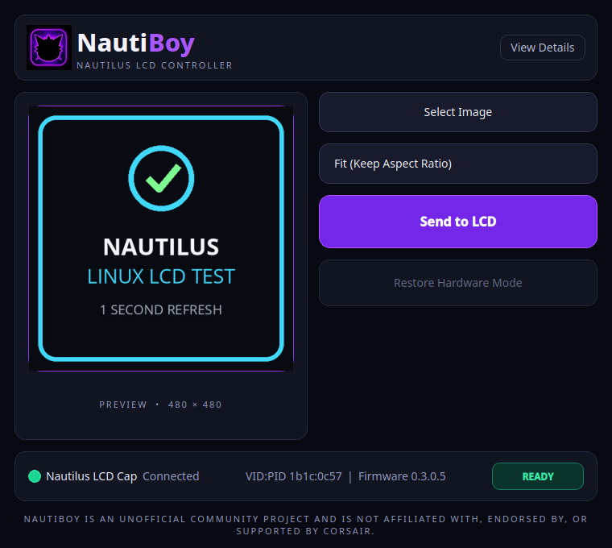

# NautiBoy

NautiBoy is an open-source Linux controller for Corsair NAUTILUS RS LCD displays.



The v0.2 development branch extends the hardware-validated v0.1 static-image
interface with bounded local GIF playback. Local JPEG, PNG, and GIF support has
no network or provider dependency. The controller's existing hardware-mode
content is restored when the application exits.

NautiBoy is an unofficial community project and is not affiliated with, endorsed
by, or supported by Corsair.

## Features

- Automatic supported-device discovery through udev and sysfs
- Firmware version display
- Local JPEG, PNG, and animated GIF input
- JPEG/PNG EXIF orientation support
- Fit and Center Crop processing to 480×480
- Static and animated local preview with media metadata
- Optional provider-neutral online GIF browser
- Bounded 1,000 ms volatile refresh with no overlapping transfers
- Manual and automatic hardware-mode restoration
- KDE/Linux system tray with background playback, Restore, and safe Quit
- Per-user single-instance activation through a Qt local socket
- Optional per-user XDG login startup, hidden to tray by default
- Normal-user operation through a narrowly scoped `uaccess` rule

## Hardware support

Confirmed hardware-tested configuration:

| Device | VID:PID | Interface | Firmware | Operating system |
|---|---|---:|---|---|
| CORSAIR Nautilus LCD Cap | `1b1c:0c57` | 0 | `0.3.0.5` | Fedora KDE Plasma 44 |

Other Linux distributions, other Nautilus LCD firmware versions, and other
Corsair LCD products are currently unverified. Device acceptance is intentionally
restricted to the tested VID, PID, and interface.

See [the hardware-validation record](docs/HARDWARE-VALIDATION.md) for the test
procedure and results.

Both local-GIF v0.2 hardware validations and the incidental experimental GIPHY
hardware result are recorded separately in
[docs/hardware-validation-v0.2.md](docs/hardware-validation-v0.2.md).
The same record covers the 153-test software suite, RPM `%check`, normal-user
udev access, Fedora RPM installation and uninstall/reinstall lifecycle, and the
successful post-reinstall static-image hardware regression. Persistent LCD
storage was never accessed or modified.

## Source installation

Requirements:

- Linux with hidraw, udev, and systemd-logind `uaccess` support
- Python 3.11 or newer
- PySide6, Pillow, and pyudev

From an extracted source release or local checkout:

```bash
python3 -m venv .venv
.venv/bin/pip install .
```

Install the narrowly scoped device-access rule:

```bash
sudo install -m 0644 packaging/70-nautilus-lcd.rules /etc/udev/rules.d/70-nautilus-lcd.rules
sudo udevadm control --reload-rules
```

Reconnect the LCD USB device or reboot so udev and logind apply the rule. Then
run NautiBoy as the normal desktop user:

```bash
.venv/bin/nautiboy
```

Do not run the GUI with `sudo`. Detailed rule verification and removal guidance
is in [docs/permissions.md](docs/permissions.md).

## Removal

1. Close NautiBoy normally so hardware mode is restored.
2. Remove the source checkout or virtual environment when no longer needed.
3. If no longer using NautiBoy, remove its udev rule:

   ```bash
   sudo rm /etc/udev/rules.d/70-nautilus-lcd.rules
   sudo udevadm control --reload-rules
   ```

4. Reconnect the LCD USB device or reboot.

If login startup was enabled, also disable it in NautiBoy before removal or
remove only its user entry:

```bash
rm -f "${XDG_CONFIG_HOME:-$HOME/.config}/autostart/io.github.nautiboy.nautiboy.desktop"
```

NautiBoy does not install a service, write controller profiles, or place
content in the LCD's persistent storage.

## Known limitations

- GIF playback is software-timed and may coalesce frames that are faster than
  safe LCD transfers
- Online GIF search is optional and experimental; local GIF support works
  without it
- No CPU/GPU monitoring screens
- NautiBoy must remain running to maintain volatile software display
- No reusable media profiles
- No persistent controller storage access
- No brightness, rotation, or frame-rate controls
- No pump, fan, RGB, or firmware operations
- Only the hardware configuration listed above has been physically validated
- The application ID is provisional and the current icon is a development raster

A final square SVG or transparent 1024×1024 icon master is desired before a
polished public release.

## Optional Desktop shortcut

An installed copy can create a shortcut in the current user's XDG Desktop
directory without sudo:

```bash
nautiboy --create-desktop-shortcut
```

The shortcut is never created automatically. Remove only NautiBoy's marked
shortcut with:

```bash
nautiboy --remove-desktop-shortcut
```

The copied desktop file is executable for desktop environments that require
that launchability bit. A desktop shell may still ask the user to confirm trust
according to its own security policy.

## Experimental online GIF search

The experimental GIPHY adapter accepts a process-only
`NAUTIBOY_GIPHY_API_KEY`, or a per-user key saved from Preferences into the
Linux desktop secret service. The environment variable takes precedence. The
key is never stored in NautiBoy settings, source files, logs, or media cache.
Without a key, GIF Search explains that it is not configured while all local
media features remain available.

GIPHY media is session-only and is not written to NautiBoy's persistent cache.
The search dialog displays “Powered by GIPHY” plus creator/source information
when available. Public distribution or enablement remains unresolved pending
clarification of GIPHY licensing, attribution, and external-display use,
including the policy implications of showing selected media on an LCD without
attribution on that physical display.

Defensive GIF limits are 25 MiB encoded input, 4096×4096 and 16 megapixels per
frame, 500 frames, ten minutes total duration, and a 64 MiB decoding working-set
ceiling.

## Safety and architecture

The direct backend revalidates the USB identity immediately before every device
open. Each image transfer is finite and bounded; short writes, disconnects, and
identity changes stop refresh without automatic retry. The GUI delegates all HID
operations to a dedicated worker thread.

Closing the main window hides NautiBoy to the system tray and keeps volatile LCD
playback active. Use **Quit NautiBoy** in the tray menu for an actual shutdown;
Quit stops scheduling, restores hardware mode when necessary, stops worker and
network threads, removes the tray icon, and exits. A second launch activates the
existing window before it can create another device owner.

See:

- [Safety model](docs/safety.md)
- [Protocol subset](docs/protocol.md)
- [Architecture](docs/architecture.md)
- [GIF playback and optional search](docs/gif-and-online-search.md)
- [Background, tray, and single-instance behavior](docs/tray-and-background.md)
- [Per-user autostart](docs/autostart.md)
- [Development and tests](docs/development.md)

The reverse-DNS application ID is `io.github.nautiboy.nautiboy`. The
`io.github` namespace remains provisional until the final public GitHub account
and repository location are established.

## License and attribution

NautiBoy is licensed under GPL-3.0-or-later. The LCD framing implementation was
informed by the GPLv3 OpenLinkHub project and independently validated on physical
hardware. See [ATTRIBUTION.md](ATTRIBUTION.md).
