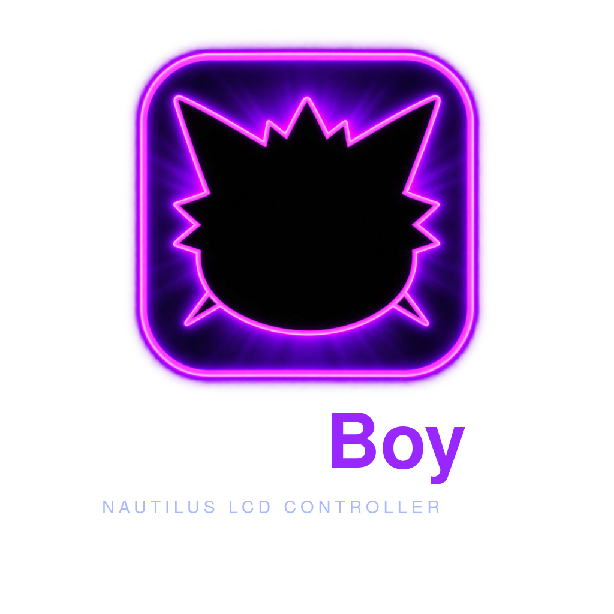
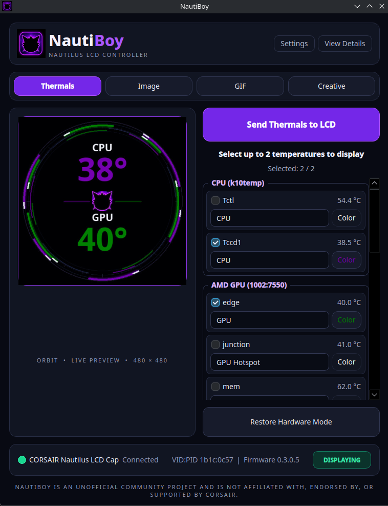
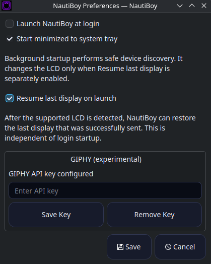

# NautiBoy

NautiBoy is an unofficial, open-source Linux controller for the Corsair
Nautilus LCD Cap.



The `v0.4.0-beta.1` release candidate supports local media, animated displays,
read-only temperature telemetry, and layered Creative compositions. It uses
volatile LCD control only: the controller's existing hardware/iCUE content is
restored on request and during a safe application shutdown.

NautiBoy is not affiliated with, endorsed by, or supported by Corsair.

## Hardware support

The deliberately narrow supported and physically tested configuration is:

| Device | VID:PID | Interface | Firmware | Tested platform |
|---|---|---:|---|---|
| CORSAIR Nautilus LCD Cap | `1b1c:0c57` | 0 | `0.3.0.5` | Fedora KDE Plasma 44 |

Other distributions, firmware versions, and LCD products are currently unverified
for control. NautiBoy's read-only hardware catalog can recognize additional
research candidates, but it will not authorize control from a VID:PID match.

## Features

- **Thermals:** up to two discovered Linux temperature sensors rendered with
  the animated Orbit display
- **Image:** local JPEG and PNG with EXIF orientation, Fit, and Center Crop
- **GIF:** bounded local animated GIF playback
- **Creative:** four persistent, renameable presets combining JPEG/PNG/GIF
  backgrounds, optional Orbit animation, and foreground telemetry
- Animated previews and safe, serialized LCD transfers with no unbounded queue
- Optional experimental GIPHY search using a user-provided API key
- Persistence for explicitly selected GIPHY media; search results stay transient
- KDE/Linux tray operation, single-instance activation, and optional per-user
  autostart
- Opt-in **Resume last display on launch**, using the last successfully sent
  snapshot rather than a newer unsent selection
- Manual restore and safe quit-time restoration of stored hardware/iCUE content
- Normal-user device access through one narrowly scoped udev rule
- Preview-first, local-only Hardware Report ZIP generation for tester USB/HID
  identification; serial numbers are hashed and nothing is uploaded automatically

## Install on Fedora

Download the release RPM for `v0.4.0-beta.1`, verify its published checksum,
then install it from a normal terminal:

```bash
sudo dnf install ./nautiboy-0.4.0~beta.1-1.fc44.noarch.rpm
```

Reconnect the Nautilus LCD USB connection, log out and back in, or reboot so
udev and the desktop session can apply normal-user access. Launch **NautiBoy**
from the application menu. Do not run the GUI with `sudo`.

The RPM installs the application, desktop/AppStream metadata, hicolor icons,
and this exact rule:

```udev
SUBSYSTEM=="hidraw", ATTRS{idVendor}=="1b1c", ATTRS{idProduct}=="0c57", TAG+="uaccess"
```

## Source/development installation

NautiBoy requires Python 3.11 or newer, PySide6, Pillow, pyudev, and keyring.
From an extracted source archive or checkout:

```bash
python3 -m venv .venv
.venv/bin/pip install .
.venv/bin/nautiboy
```

For source installs, install `packaging/70-nautilus-lcd.rules` separately as
described in [the permissions guide](docs/permissions.md).

## Optional GIPHY search

Local GIF playback is independent of GIPHY. To use the experimental provider,
open **Settings → GIPHY**, enter your own API key, and save it to the desktop
Secret Service/keyring. The masked field never reads the key back. A process-only
`NAUTIBOY_GIPHY_API_KEY` value takes precedence for development use.

GIPHY is unconfigured by default. No key is embedded in NautiBoy or written to
settings, logs, selected-media metadata, or packages. Public distribution and
external-LCD use remain subject to unresolved GIPHY credential, licensing,
attribution, analytics, and policy requirements.

## Desktop behavior

Closing the main window hides it while playback continues in the tray. Use the
tray's **Quit NautiBoy** action for a full shutdown and hardware-mode restore.
Preferences can enable per-user login startup and start hidden in the tray;
startup never sends media unless **Resume last display on launch** is enabled.

The resume option stores the last *successfully sent* display separately from
the current UI selection. On launch it validates the local snapshot and makes
one bounded resume attempt after device setup. It does not search GIPHY or make
a provider network request.

An installed copy can optionally create or remove its own XDG Desktop shortcut:

```bash
nautiboy --create-desktop-shortcut
nautiboy --remove-desktop-shortcut
```

## Troubleshooting

- **Device not detected or permission denied:** reconnect the LCD USB device,
  then log out/in or reboot. Confirm the packaged udev rule is present and the
  matching hidraw node has a `uaccess` ACL for your desktop user.
- **Temperature missing:** NautiBoy reads standard Linux `hwmon` data without
  root. A sensor absent from `/sys/class/hwmon` cannot be displayed; kernel and
  hardware support vary.
- **Window disappeared:** normal window close hides NautiBoy to the tray. Use
  the tray icon to reopen or quit it.
- **GIPHY unavailable:** configure a user API key and ensure a compatible Secret
  Service/KWallet backend is running. Local GIFs continue to work without it.
- **Display did not resume:** enable **Resume last display on launch** and first
  complete a successful Send. Missing/corrupt resume media fails safely without
  touching the LCD.
- **Return to stored iCUE content:** choose **Restore Hardware Mode** or quit
  NautiBoy through its tray action.

## Hardware reports for testers

Open **Settings → Generate Hardware Report** to create a read-only support
bundle without terminal commands. NautiBoy first displays the complete text and
JSON contents for review. If you choose Save, it creates one local ZIP containing
`hardware-report.txt` and `hardware-report.json`.

The collector reads Linux sysfs and operating-system metadata only. It does not
open USB or hidraw device nodes and cannot send feature reports, frames, or other
hardware commands. Serial numbers are replaced by a new non-reversible hash for
each report. The report is never uploaded automatically.

If hardware is unsupported or identified incorrectly, review the saved ZIP and
send it yourself to **hardware@nautiboy.dev**. NautiBoy never uploads or emails
reports automatically.

## Uninstall and user data

Quit NautiBoy first, then remove the RPM:

```bash
sudo dnf remove nautiboy
```

RPM removal deletes package-owned system files but intentionally retains user
settings and selected media. Depending on XDG environment variables, NautiBoy
data is stored under these default locations:

- `~/.config/nautiboy/` — profiles, telemetry presentation, and settings
- `~/.local/share/io.github.nautiboylinux.nautiboy/` — selected/resume media
- `~/.cache/nautiboy/` — transient application cache
- `~/.config/autostart/io.github.nautiboylinux.nautiboy.desktop` — optional
  login startup entry

Remove those only if you also want to discard your user state. Saved GIPHY
credentials live in the desktop keyring and should be removed through NautiBoy
Preferences before uninstalling.

## Safety and limitations

- NautiBoy must remain running to maintain volatile software display control.
- GIF/composited scheduling may coalesce frames faster than safe LCD transfers.
- Persistent LCD storage, firmware, brightness, rotation, pump, fan, and RGB
  control are intentionally unsupported.
- GIPHY integration is experimental and user-key-only.
- Only the hardware and platform listed above have been physically validated.

See the [architecture](docs/architecture.md), [safety model](docs/safety.md),
[protocol subset](docs/protocol.md), [hardware validation](docs/HARDWARE-VALIDATION.md),
and [beta release notes](docs/release-notes-v0.4.0-beta.1.md).

## Screenshots

### Thermals and Orbit



### Preferences



These captures show the current public-beta interface. Historical development
screenshots elsewhere in `docs/` remain validation history and are not presented
as current release UI. Media-profile screenshots containing third-party content
are intentionally omitted until suitable redistribution-safe demo media exists.

## License and support

Source code is GPL-3.0-or-later. NautiBoy artwork is copyright Andrew Tyler and
licensed separately under CC BY-SA 4.0; see [ARTWORK-LICENSE.txt](ARTWORK-LICENSE.txt).
The protocol work was informed by the GPLv3 OpenLinkHub project; see
[ATTRIBUTION.md](ATTRIBUTION.md).

Visit [nautiboy.dev](https://nautiboy.dev) for the official project site.
Report bugs through [GitHub Issues](https://github.com/NautiBoyLinux/nautiboy/issues),
use **support@nautiboy.dev** for general support, or use
**hardware@nautiboy.dev** for compatibility work and reviewed Hardware Reports.
